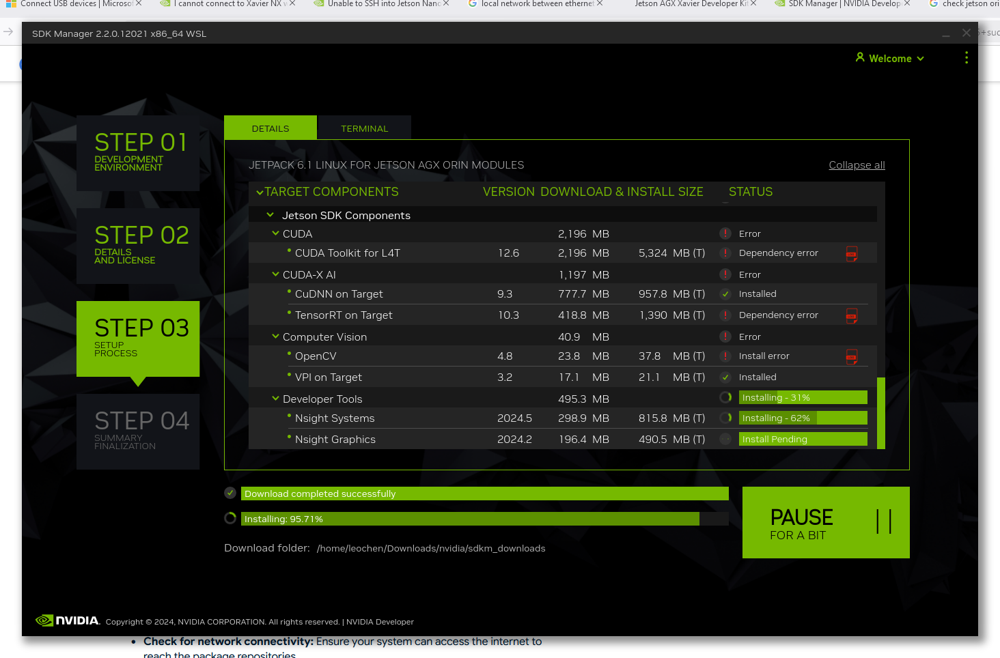
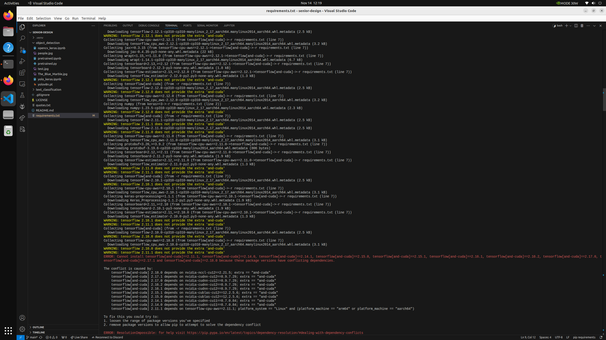
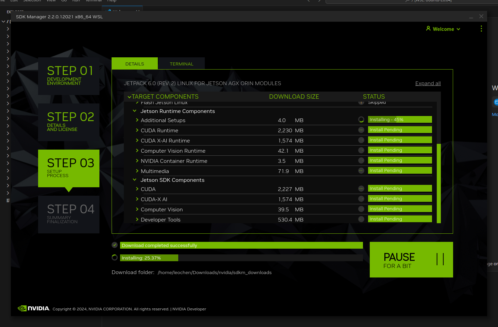

### Jetson AGX Xavier

Unable to install SDK because no ethernet + internet connection

Flash was successful but no GUI terminal were able to boot

### Jetson AGX Orin

Errors with CUDA toolkit install (Jetpack 6.1)

Tensorflow[and-cuda] requires an older vsion of cnDNN.

Reinstall with Jetpack 6.0. No problems so far...

